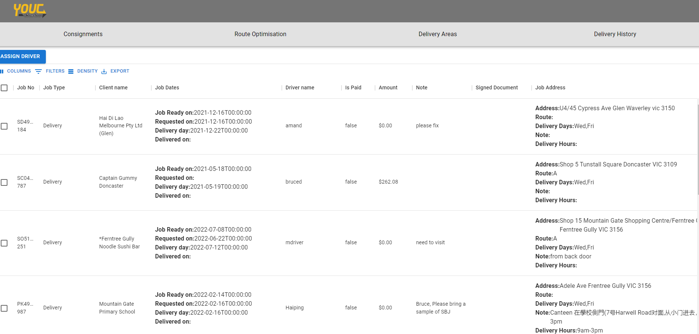
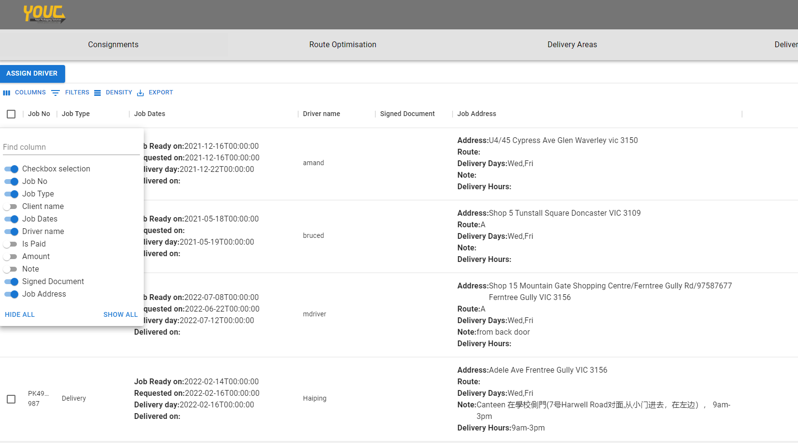
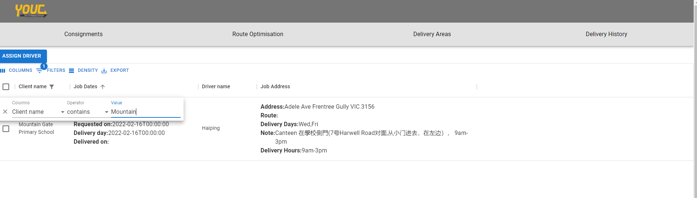
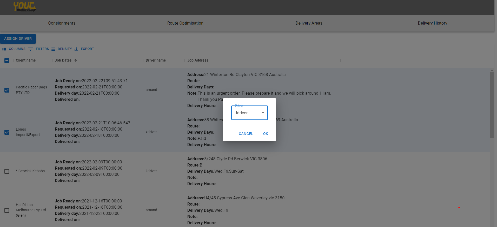
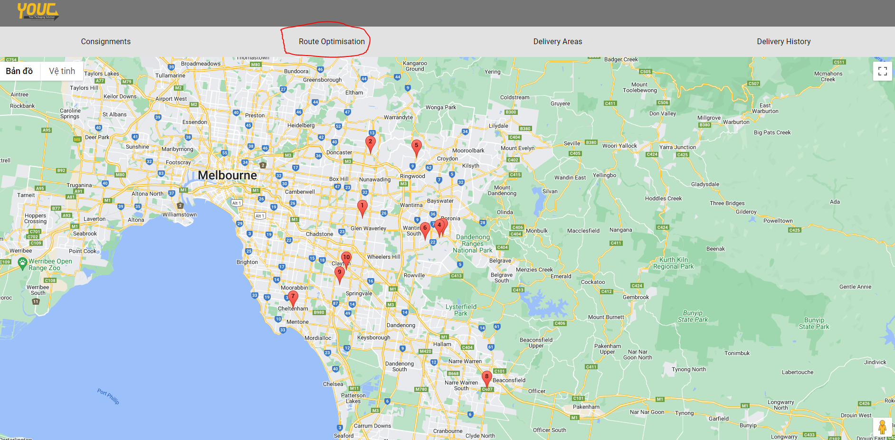
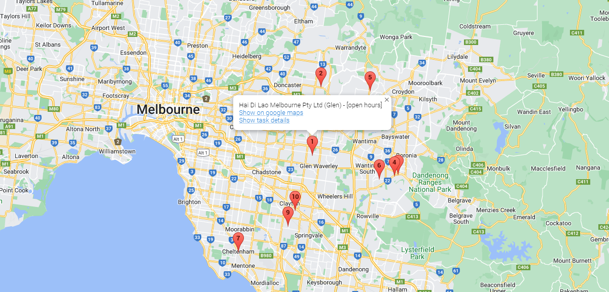

# Admin guide
Admin will need to login with their admin account in order to see any pages 

## Consignments page
For admin, consignment page will show all active consignments under data table in desktop version. The admin will be able to perform certain actions based on their role. 

## Searching and Filtering
In data table, admin can perform certain actions such as filter, search, export to pdf, show/hide columns
### Show/hide columns
In order to choose what column to hide/show, click the 'COLUMNS' button on top left of the table, then turn on or off the columns you want to show/hide

Similar to Filters, click on the 'FILTERS' button , a small filter options will pop up with 'Columns', 'Operator' and 'Value' option. Here, Columns means which column this filter is for, 'Operator' stands for which operations you want to make, and 'Value' is the value you want to use for the filter. 

## Assign Driver
Admin can assign available drivers to active consignments. In order to do so, select one or multiple consignments that you want to assign to a driver, then click the 'ASSIGN DRIVER' button at top left of the data table. Dropdown option will appear and you can change the assigned driver to any available driver. 

## View map route
On the Navigation bar, click to Route Optimisation in order to view the location of all consignments in map.

Click on any of the markers will show the client name for that consignment task, as well as the reference link towards googlemaps location and task detail.
