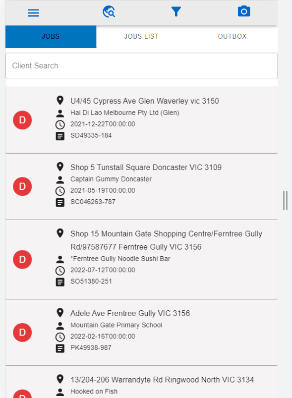

# Drivers guide
Drivers will need to login to their account in order to view the consignments

## Consignments
After logged in, drivers will be able to see all consignments that were assigned to them. Drivers are expected to use their phone as it was assuming they will not be using desktop most of the time. Therefore, most instruction images will be shown under mobile view.

Tap any consignment task will lead you to the detail page. Here, driver can update the progress of the consignment by adding proof images, payment method, amount paid by customer, add comments for any issue if have.
  
When consignment is finished and all information regarding to the task was added, driver can hit the 'SUBMIT' button on top right of the card to submit the task

## Map
In order to access Map, driver can click the 'Global icon' on the Navigation bar, or open 'MENU' and select 'Route Optimisation'
Map will show the location of all consignments assigned to the driver, with the number on each marker regarding to the default order the driver have to do consignments. However, driver can change the order by going back to the consignments page. Click and hold on card to hold and drag them up or down to change their order in the map